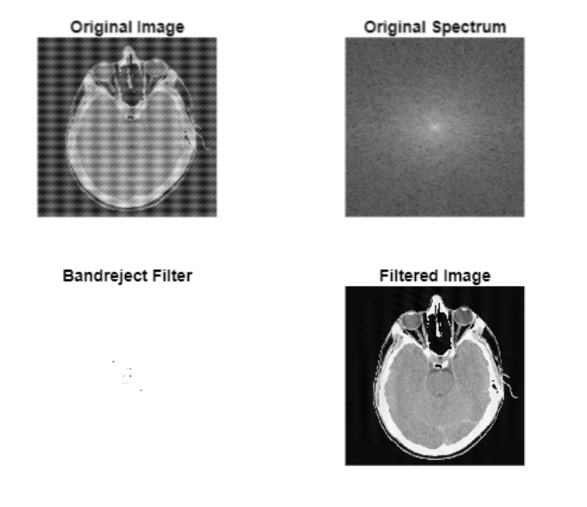

**1. The image on the left is filtered in the Fourier domain to obtain the image on the right. The outer data in the image on the right is much depressed, even though there is structure visible. The data in the middle is unaffected. Note: No digital image processing is required for this problem!**  
a. Is the filter a high-pass or low-pass filter? 
b. Sketch a generic plot of the transfer function of this type of filter. Be sure to label axes & standard units!
c. Determine the cut-off frequency for this filter in 1/mm. Some hints are:
i. Determine the circumference at the cutoff in millimeters. 
ii. Determine the number of cycles.


**2. The DFT of a flat disk of amplitude 1 is F(x,y)=f1(x,y) + jf2(x,y). The DFT of a flat square of amplitude 2 is G(x,y)=g1(x,y) + jg2(x,y). What is the magnitude of the DFT of a flat disk of amplitude 4 added to a square of amplitude -2? This is a really simple problem that you will probably see on an exam. Don’t try to make it difficult!**

**3. Using Bandreject Filtering for Image Denoising. Image FigP0405 (HeadCT_corrupted).tif is a tomography image of a human head, heavily corrupted by sinusoidal noise in at least two directions.** 
a. Clean up the image using bandreject filtering. To simplify your project you may ignore padding in this case. Hint: Since the noise is sinusoidal, it will show in the spectrum as impulses. Display the spectrum as a guide to where to set up the band of your filter. If you use function impixelinfo to determine the coordinates of the impulses interactively, keep in mind that this function lists the column coordinates (v) first and the row coordinates (u) second.

uses the `impixelinfo` function to interactively identify the column and row coordinates of the noise's impulse in the frequency spectrum,

 computes the 2D FFT of the input image and displays the enhanced magnitude spectrum to guide the placement of filters.
 a bandreject filter is designed to remove sinusoidal noise by attenuating the frequency impulses and their symmetric counterparts.




b. Use bandpass filtering to extract the noise pattern.

The bandreject filter uses Gaussian attenuation around the identified noise coordinates, ensuring smooth transitions and minimal artifacts in the cleaned image. 


```
% Load image
img = imread('D:\drive\OneDrive - Case Western Reserve University\FILE\2025spring\EBME461 Image\GroupProject\HW05\HW05_EBMECSDS_361461_Images\FigP0405(HeadCT_corrupted).tif');
if size(img, 3) == 3 % If RGB, convert to grayscale
    img = rgb2gray(img);
end

% Compute the 2D FFT
f_transform = fft2(img);
f_shift = fftshift(f_transform);

% Calculate magnitude spectrum and apply log transformation
magnitude_spectrum = abs(f_shift);  % Get magnitude
enhanced_spectrum = log(1 + magnitude_spectrum);  % Log transform

% Create a figure with two subplots
figure;

% Display original image
subplot(1,2,1);
imshow(img, []);
title('Original Image');
axis off;

% Display spectrum
subplot(1,2,2);
imshow(enhanced_spectrum, []);  % Display the enhanced spectrum
title('Frequency Spectrum');
axis off;

% Add pixel info tool
impixelinfo  % This enables the interactive pixel information display


figure;
imshow(magnitude_spectrum, []);
impixelinfo  

band rejector
% Create the bandreject filter
[M, N] = size(img);
[X, Y] = meshgrid(1:N, 1:M);
center_x = 257;
center_y = 257;

% Define noise points (excluding the center point)
noise_points = [
    217, 217;   % Point 1
    297, 297;   % Point 2
    267, 237;   % Point 3
    247, 257;   % Point 4
    267, 257;   % Point 5
    257, 277;   % Point 6
    297, 297    % Point 7
];

% Create the notch filter
H = ones(M, N);
D0 = 1;  % Width of the reject band 

% Apply notch for each noise point and its symmetric point
for i = 1:size(noise_points, 1)
    x = noise_points(i,1);
    y = noise_points(i,2);
    
    % Distance from current point
    D1 = sqrt((X - x).^2 + (Y - y).^2);
    
    % Calculate symmetric point coordinates
    x_sym = 2*center_x - x;
    y_sym = 2*center_y - y;
    
    % Distance from symmetric point
    D2 = sqrt((X - x_sym).^2 + (Y - y_sym).^2);
    
    % Create notch for both points
    H = H .* (1 - exp(-D1.^2/(2*D0^2))) .* (1 - exp(-D2.^2/(2*D0^2)));
end

% Apply the filter
filtered_spectrum = f_shift .* H;

% Inverse FFT to get filtered image
filtered_image = real(ifft2(ifftshift(filtered_spectrum)));

% Display results
figure;
subplot(2,2,1);
imshow(img, []);
title('Original Image');

subplot(2,2,2);
imshow(log(1 + abs(f_shift)), []);
title('Original Spectrum');

subplot(2,2,3);
imshow(H, []);
title('Bandreject Filter');

subplot(2,2,4);
imshow(filtered_image, []);
title('Filtered Image');
band pass
% Create the bandpass filter (opposite of bandreject)
[M, N] = size(img);
[X, Y] = meshgrid(1:N, 1:M);
center_x = 257;
center_y = 257;

% Define noise points (excluding the center point)
noise_points = [
    217, 217;   % Point 1
    297, 297;   % Point 2
    267, 237;   % Point 3
    247, 257;   % Point 4
    267, 257;   % Point 5
    257, 277;   % Point 6
    297, 297    % Point 7
];

% Create the bandpass filter (H_bp = 1 - H_br)
H = zeros(M, N); 
D0 = 1; 

% Apply pass band for each noise point and its symmetric point
for i = 1:size(noise_points, 1)
    x = noise_points(i,1);
    y = noise_points(i,2);
    
    % Distance from current point
    D1 = sqrt((X - x).^2 + (Y - y).^2);
    
    % Calculate symmetric point coordinates
    x_sym = 2*center_x - x;
    y_sym = 2*center_y - y;
    
    % Distance from symmetric point
    D2 = sqrt((X - x_sym).^2 + (Y - y_sym).^2);
    
    % Create pass band for both points
    H = H + exp(-D1.^2/(2*D0^2)) + exp(-D2.^2/(2*D0^2));
end

% Clip filter values to range [0,1]
H = min(H, 1);

% Apply the filter
filtered_spectrum = f_shift .* H;

% Inverse FFT to get noise pattern
noise_pattern = real(ifft2(ifftshift(filtered_spectrum)));

% Display results
figure;
subplot(2,2,1);
imshow(img, []);
title('Original Image');

subplot(2,2,2);
imshow(log(1 + abs(f_shift)), []);
title('Original Spectrum');

subplot(2,2,3);
imshow(H, []);
title('Bandpass Filter');

subplot(2,2,4);
imshow(noise_pattern, []);
title('Extracted Noise Pattern');
```

**4. We will now investigate low-pass filtering in the frequency domain using the images “wheel.tif” and “edges.tif”. For both images do the steps below.**
a. Apply an ideal low-pass filter at a frequency which is 1/3 the maximum 
frequency. 
b. Apply a low-pass Gaussian filter with a width at half maximum amplitude which 
is 1/4 the maximum frequency. Recall the equation for a 2D Gaussian filter you 
had to use in Hw2 Prob 4a. 
c. Print out these images for report 
i. The 2 original images before filtering in Cartesian domain
ii. The 2 original images before filtering in frequency domain
iii. The 2 images after ideal low-pass filtering in frequency domain
iv. The 2 images after ideal low-pass filtering in Cartesian domain
v. The 2 images after Gaussian low-pass filtering in frequency domain
vi. The 2 images after Gaussian low-pass filtering in Cartesian domain
vii. Create an image of the ideal low-pass filter in the space domain
viii. Create an image of the Gaussian low pass filter in the space 
domain
d. Compare the two filters and explain results: Which yields less ringing artifacts? 
Which yields better smoothing/blurring?